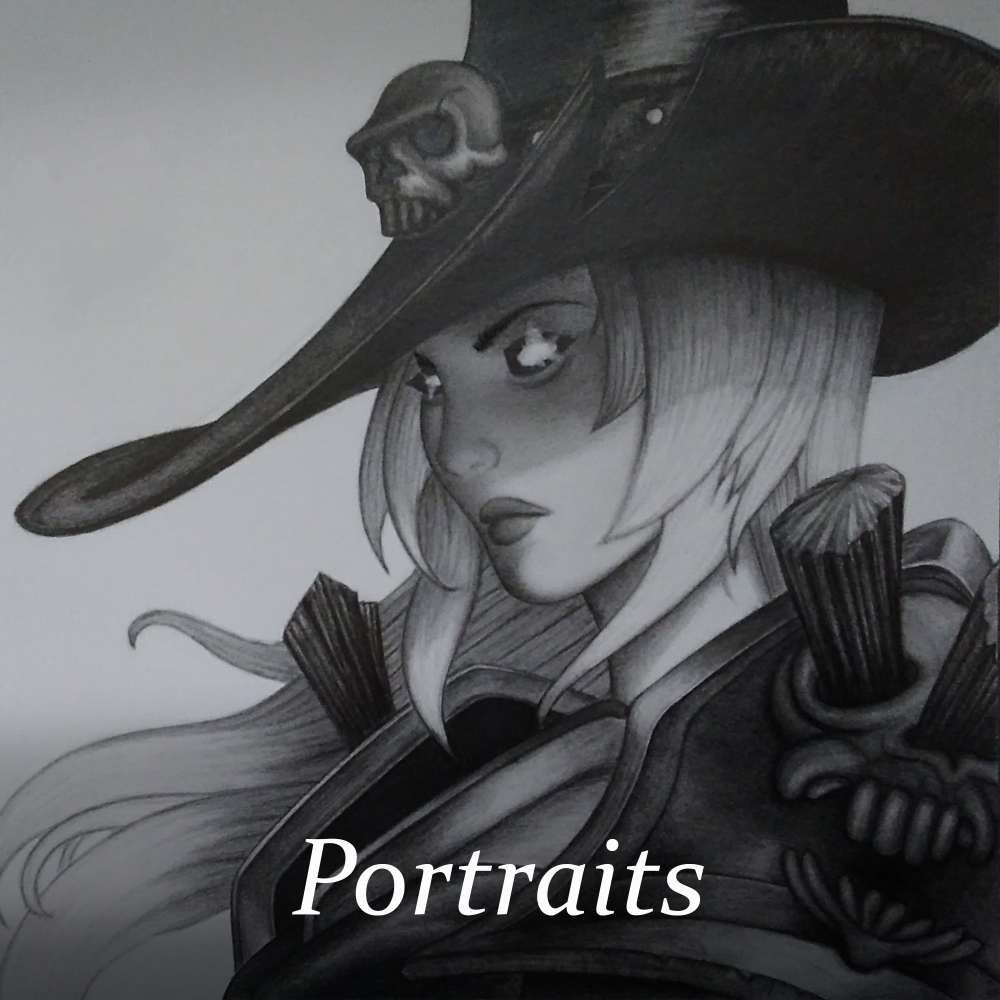
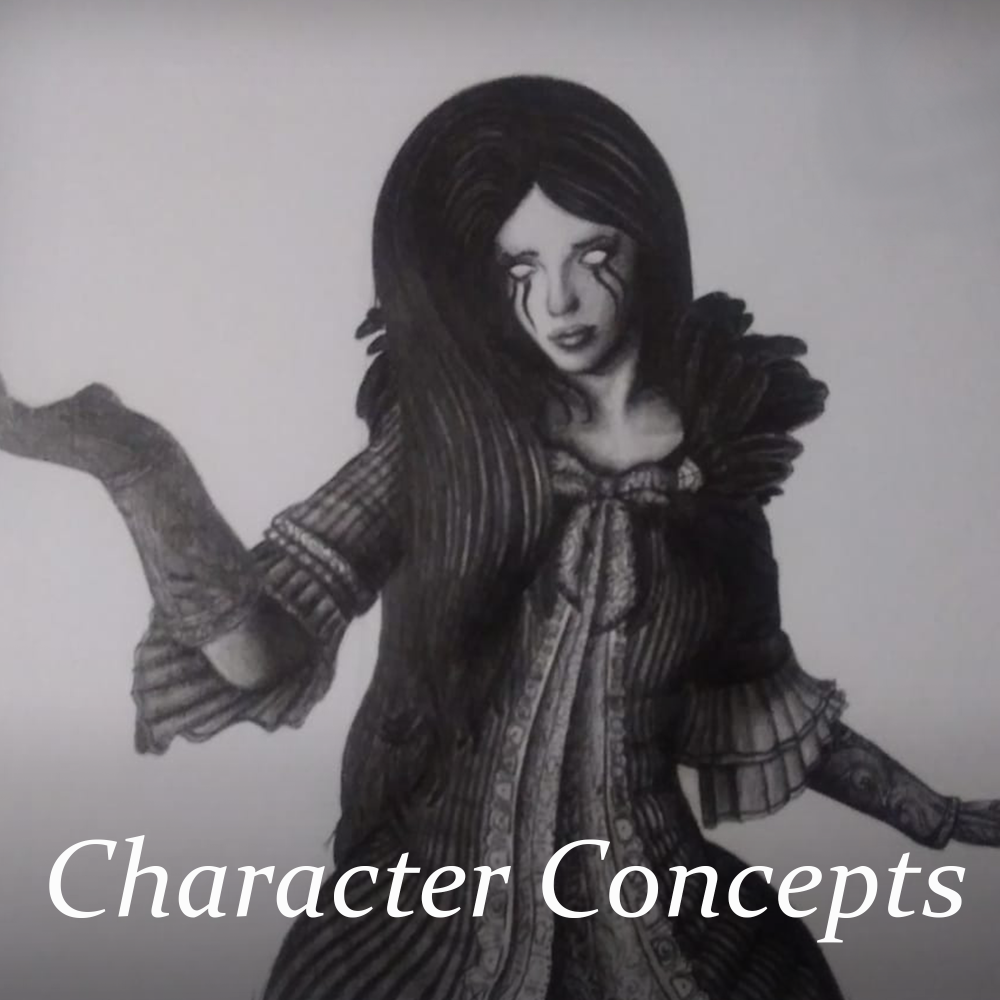
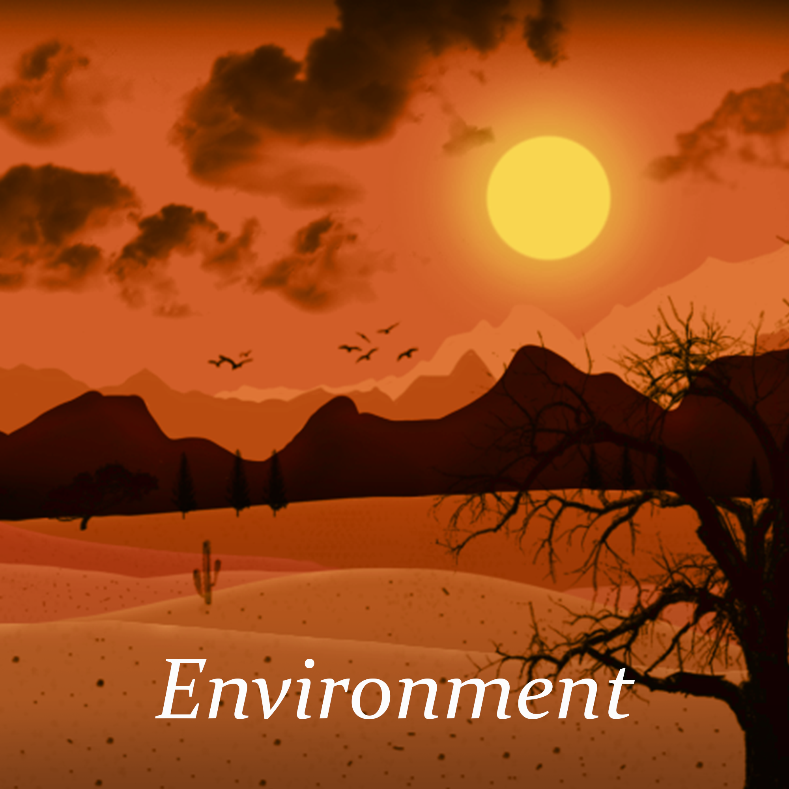
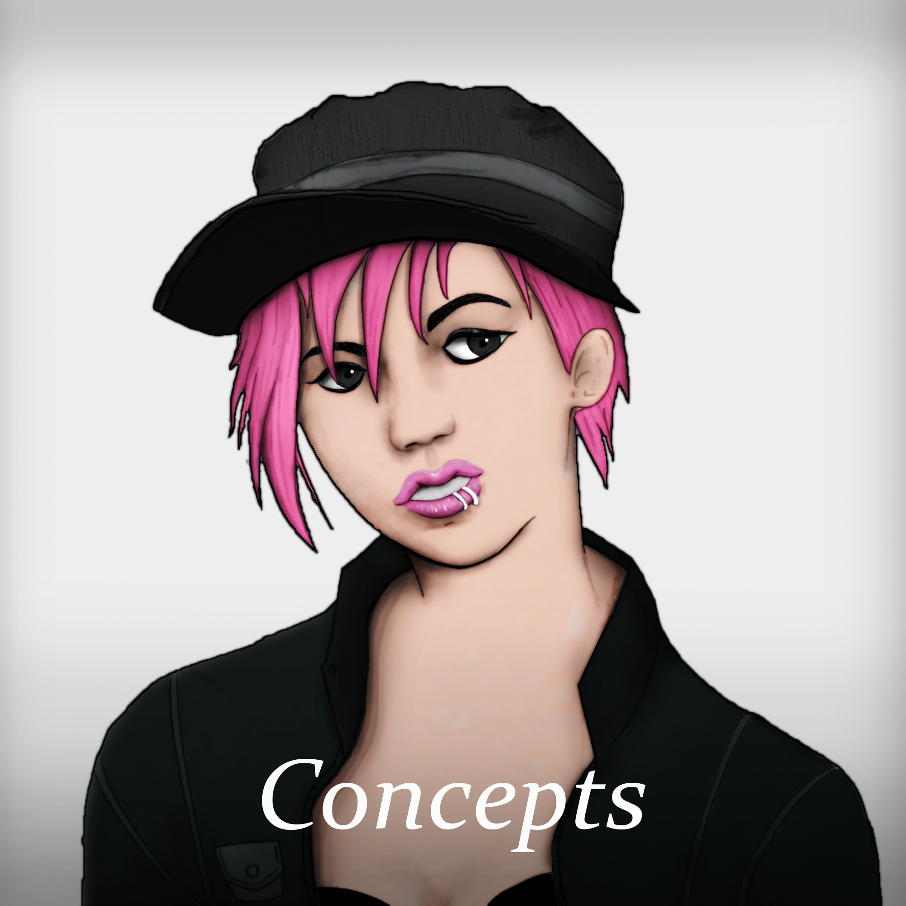
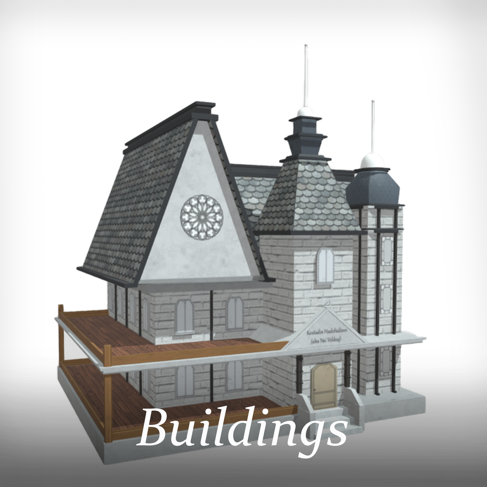
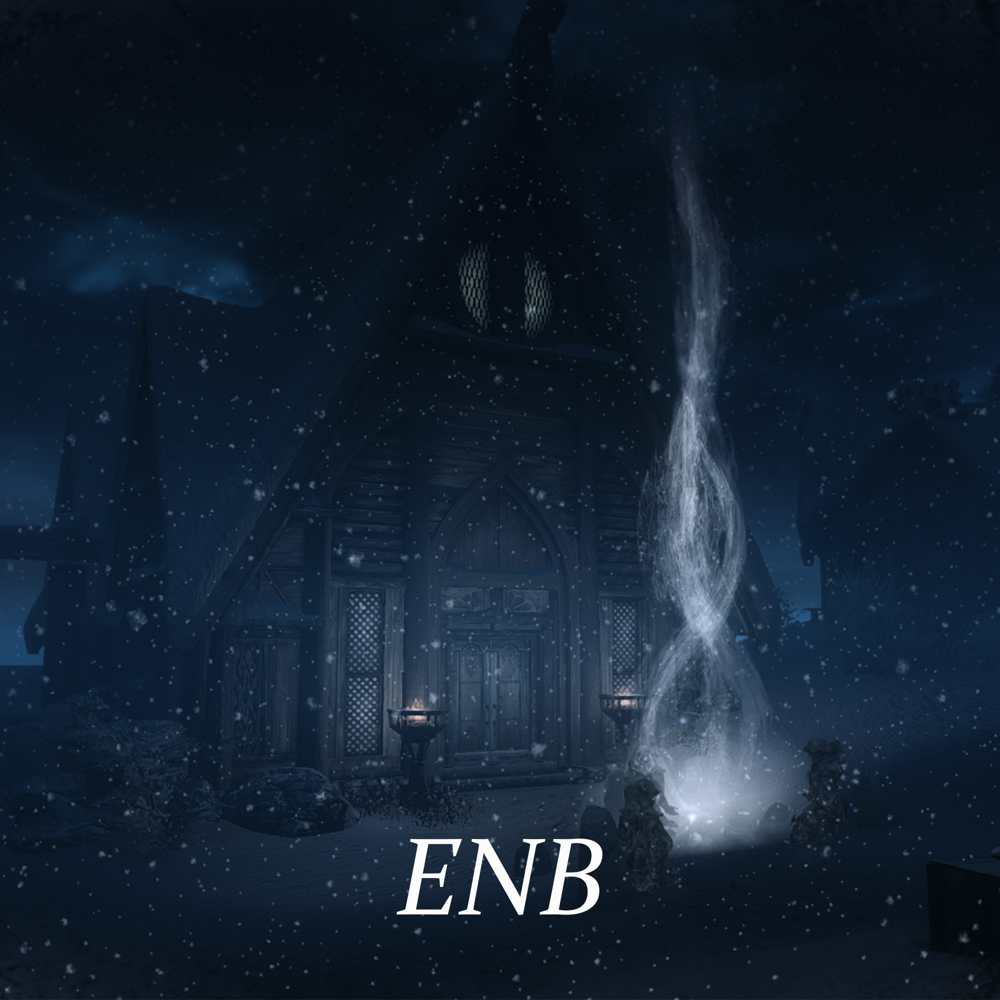

### [Main Page](https://kostadinhdz.github.io/Kostadin-Hadzhidinev/)

# Drawings of different characters

**Hand drawing**
- I can create very realistic drawings using pencils. Mainly character concepts or portraits but I can also draw environment.
- I can also draw with a graphical tablet using different programs(mainly photoshop).

**Languages**
- English(fluent)
- German(beginner)

## Pencil drawings

 

## Digital drawings

  

## Maya

## Other

